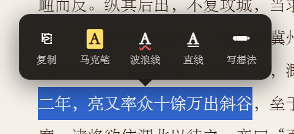
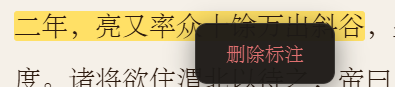

# 简单阅读器

纯前端的本地文本阅读器，支持 TXT / PDF / EPUB 格式，无需服务器，用浏览器直接打开 `reader.html` 即可使用。

## 项目结构

```
yueduqi/
├── reader.html   # HTML 骨架：页面结构与所有 UI 元素
├── style.css     # 样式：主题变量、布局、各面板、书架卡片
├── app.js        # 逻辑：所有交互与功能实现
└── README.md
```

> 依赖两个 CDN 库（需联网加载）：
> - [PDF.js 3.11](https://cdnjs.cloudflare.com/ajax/libs/pdf.js/3.11.174/pdf.min.js) — PDF 文字提取
> - [JSZip 3.10](https://cdnjs.cloudflare.com/ajax/libs/jszip/3.10.1/jszip.min.js) — EPUB 解压

---

## 功能概览

### 书架（IndexedDB 持久化）
- 导入的书籍自动保存到浏览器 IndexedDB，下次打开无需重新导入
- 书卡显示书名、格式、上次阅读日期和章节
- 点击书卡恢复到上次阅读位置；悬停后点「✕」删除

### 格式支持
| 格式 | 处理方式 |
|------|----------|
| TXT | FileReader 直接读取（UTF-8） |
| PDF | PDF.js 逐页提取文字内容 |
| EPUB | JSZip 解压 → 解析 OPF spine → 按顺序拼接章节 HTML → 提取纯文本 |

### 阅读模式
- **单栏滚动**：默认模式，连续滚动，适合长篇浏览
- **双栏分页**：CSS `column-count:2` + 固定高度；翻页时 DOM 内容整体替换（非 translateX 滑动），支持键盘左右方向键和底部按钮翻页；底部页码可点击直接跳页

### 目录（自动检测）
识别以下标记（出现 ≥2 次才启用）：
- `【…】` — 一级标题（史书卷名等）
- `◎…` — 二级标题
- `第X章/节/卷/篇/回`、`Chapter N`、`Part N`

目录抽屉随滚动自动高亮当前章节（scrollspy）。

### 全文检索
- 实时检索，结果按章节分组，每组最多显示 5 条上下文片段
- 支持逐条翻阅（`◀ N/M ▶`）；Ctrl+F 打开/关闭

### 笔记
- 笔记与书籍绑定存储在 IndexedDB，自动关联当前章节
- 删除书籍时笔记一并清除

### 字体 / 主题
- 字号 12–34 px（滑块调节）
- 内置字体：宋体 / 楷体 / 仿宋 / 黑体 / 等宽；支持导入本地 `.ttf/.woff/.woff2/.otf` 字体文件
- 浅色 / 深色主题切换

### 划线
目前支持简单的划线功能，主要功能如下
右键可以删除划线和高亮
---

## app.js 功能分区

| 区域 | 内容 |
|------|------|
| State / DOM | 状态变量声明、DOM 元素引用 |
| Helpers | `esc`、`escRe`、`debounce`、`normPath` |
| IndexedDB | `openDB` / `loadBooks` / `upsertBook` / `deleteBook` / `savePosition` / `getNotes` / `saveNotes` |
| File open | `loadFile`、`readText`、`readAB`、拖拽处理 |
| PDF parser | `parsePdf` |
| EPUB parser | `parseEpub`、`htmlToText` |
| TOC | `detectToc`、`renderToc` |
| Rendering | `render`（解析文本 → 构建 lineElements） |
| Scrollspy | scroll 事件监听 → 自动高亮 TOC + 保存进度 |
| Search | `doSearch`、`highlightAll`、`clearHighlights`、`nextR`/`prevR`、结果面板 |
| Panels | TOC / 笔记 / 字体面板的 open/close 逻辑 |
| Layout / Pagination | `buildPageLineMap`、`applyColumnsMode`、`leaveColumnsMode`、`goToPage`、`restoreAllElements` |
| Side buttons | 右侧悬浮按钮事件绑定 |
| showState | 统一切换各界面状态（`welcome` / `loading` / `reader` / `shelf`） |
| Shelf | `renderShelf`、`goToShelf`、`openBookFromShelf` |
| Help modal | 使用说明弹窗逻辑 |
| Startup | `rebuildFontGrid()`、`goToShelf()` |
